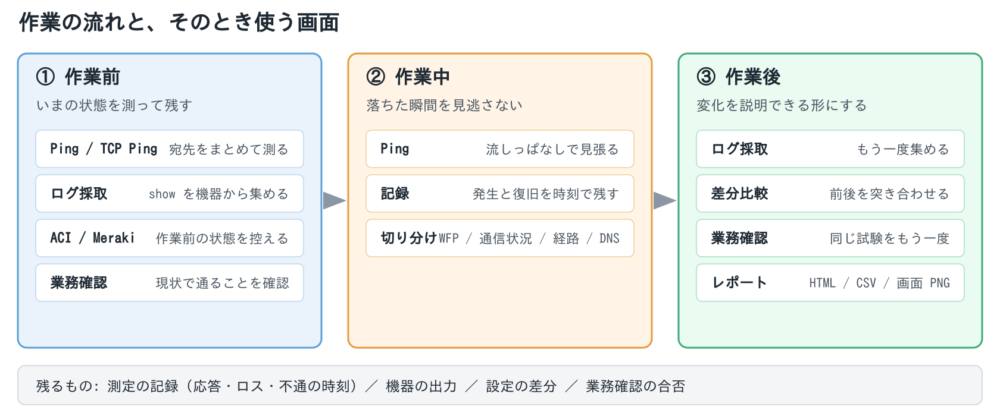
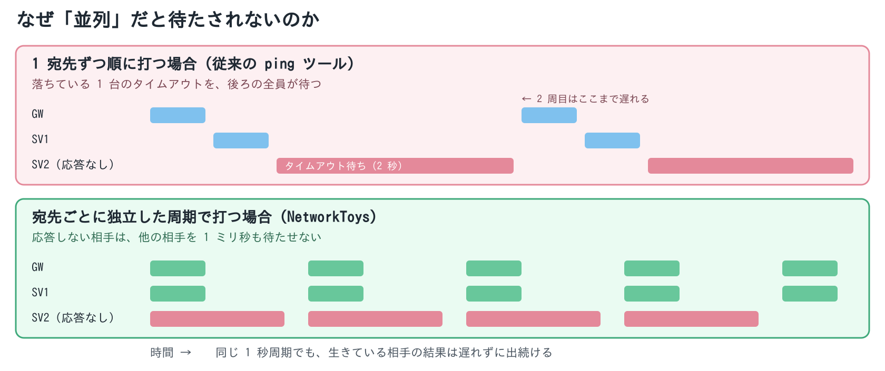
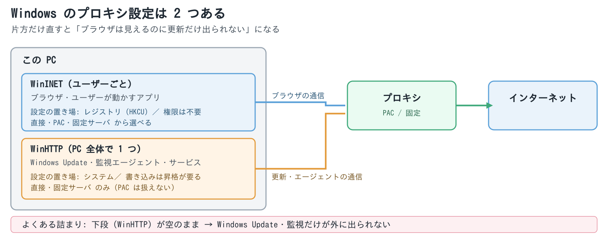
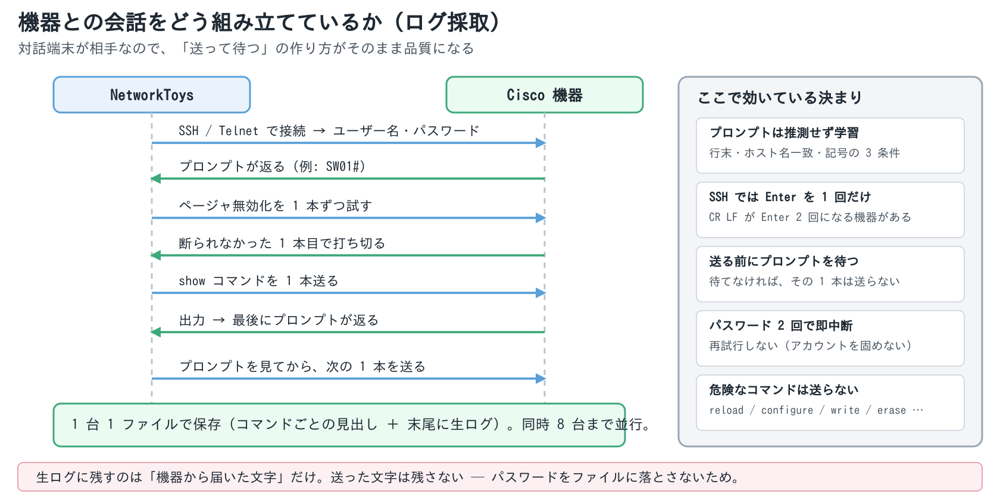
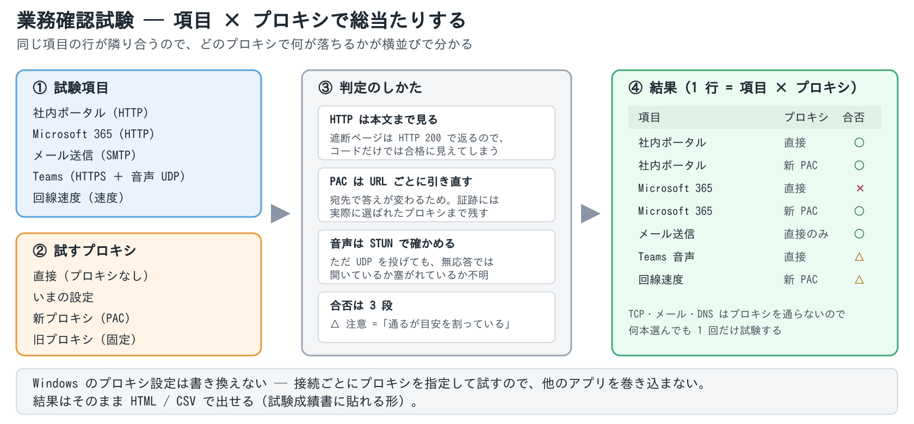
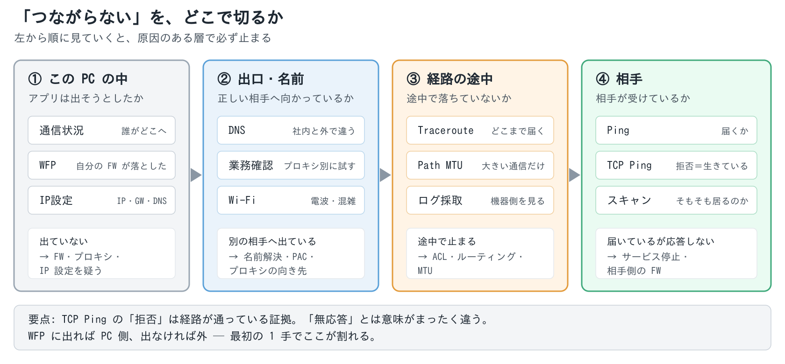

# NetworkToys 技術資料

使っている仕組みと、現場での使いどころ

> 2026-08-18 版　／　対象: Windows 10・11 (x64)　／　ライセンス: MIT
> ネットワークエンジニア向けに、**何をどう見ているか**と**どんな場面で使えるか**をまとめた資料です。
> 実装の詳細は `docs/設計資料.md`、操作方法は `docs/USAGE.md`（アプリの「ヘルプ → 使い方」）にあります。

## 1. どういう道具か

ネットワーク変更作業の**前に測り、作業中に見張り、後に証跡として残す**ための Windows アプリです。
現場で立ち上げ直していた道具 — ping・TCP 疎通・DNS・traceroute・IP スキャン・無線調査・
syslog 受信・機器へのログイン・設定差分・コントローラ照会 — を 1 つに集めてあります。

| 前提 | 内容 |
|---|---|
| 動作環境 | Windows 10 / 11 (x64)。単一 exe でインストール不要、フォルダごと USB で持ち出せる |
| 権限 | 既定は**非管理者**（`asInvoker` 固定）。管理者が要るのは後述の 2 か所だけ |
| 外部依存 | クラウドや自前サーバへの常時接続は無し。通信するのは**測っている相手だけ** |
| 設定の置き場 | exe と同じフォルダの `settings.json`。**パスワードと API キーは保存しない** |

## 2. 何を見るのに、何を使っているか

| 機能 | 使っている仕組み | 権限 |
|---|---|---|
| Ping | ICMP エコー。宛先ごとに独立した周期ループ | 不要 |
| TCP Ping | TCP の 3 ウェイハンドシェイク（RST で即閉じ） | 不要 |
| Traceroute | TTL を 1 ずつ増やした ICMP と、返る TTL 超過 | 不要 |
| Path MTU | DF ビット付きの大きなパケットと ICMP「要フラグメント」 | 不要 |
| DNS | 複数の DNS サーバへ同時に問い合わせて横並び比較 | 不要 |
| スキャン | ICMP ＋ ARP テーブル（`GetIpNetTable2`）＋ 逆引き | 不要 |
| Wi-Fi | Windows の WLAN API（接続情報・BSS 一覧） | 位置情報の許可 |
| 通信状況 | `GetExtendedTcpTable` / `GetExtendedUdpTable` | 不要 |
| 通信状況の B/秒 | ETW のカーネルネットワークイベント | **管理者** |
| WFP | Windows Filtering Platform の遮断イベント | **管理者** |
| IP設定 | `netsh` を昇格して 1 ファイルで流す | 適用時に UAC |
| プロキシ設定 | WinINET（レジストリ）と WinHTTP（API・昇格して書く） | 下段のみ UAC |
| ログ採取・差分比較 | SSH / Telnet の端末セッションを状態機械で操る | 不要 |
| 業務確認 | HTTP / TCP / SMTP・IMAP・POP3 / DNS / STUN / 速度測定 | 不要 |
| 受け側サーバ | FTP / TFTP / SFTP / syslog(514) / SNMP Trap(162) | 不要（初回のみ FW 許可） |
| Meraki | Dashboard API（REST） | 不要 |
| ACI | APIC の REST API | 不要 |

## 3. 測る仕組み

### 3.1 ping は宛先ごとに独立して打つ

EXPing のように 1 宛先ずつ順に打つと、**落ちている 1 台が全体を待たせます**。
NetworkToys は宛先ごとに独立した周期ループを持ち、応答しない相手が他を 1 ミリ秒も待たせません。
数百宛先でも一覧はなめらかに動きます。

- **RTT は自前のストップウォッチで測ります。**`PingReply.RoundtripTime` は失敗時に 0 を返すため、
  応答が返らなかった回を平均に混ぜないためにも自前で測る必要があります
- ホスト名は**起動時に一度だけ解決**して覚えます（毎周期 DNS を引くと、その時間が RTT に化けます）
- **2 回続けて応答が無い宛先は赤い欄に浮き上がります。**落ちた瞬間と復旧した時刻は自動で記録され、
  レポートの「不通の記録」表になります

### 3.2 TCP Ping は 3 状態で返す

ICMP が塞がれている相手には TCP でつなぎます。結果は**つながる / 拒否 / 無応答**の 3 つで、
この区別が切り分けの決め手になります。

| 結果 | 意味すること |
|---|---|
| つながる | そのポートで待ち受けている |
| **拒否**（RST） | **相手は生きているが、そのポートが閉じている**（＝経路は通っている） |
| 無応答 | 途中で落とされているか、相手が居ない |

測定用の接続は **RST で閉じます**（`SO_LINGER` 0 秒）。行儀よく FIN で閉じると `TIME_WAIT` が
約 4 分残り、200 宛先 × 1 秒間隔なら数分でエフェメラルポートが枯渇するためです。
データを流さない測定用の接続なので、RST で切っても相手は困りません。

### 3.3 経路と MTU

traceroute は TTL を 1 ずつ増やして投げ、返ってくる ICMP TTL 超過から経路を組み立てます。
**TTL を完全並列にすると欠落ホップが出ます**（ルータ側で ICMP の生成にレート制限がかかるため）。
TTL ごとに 20〜30ms ずらして投げ、確実性を優先したい場面のために逐次モードも用意しています。

Path MTU は DF ビットを立てた大きなパケットで探ります。**「要フラグメント」を返さないルータ**
（ブラックホール）があると、大きすぎる場合の応答が `PacketTooBig` ではなく無応答になるので、
その 2 つを区別して記録します。VPN や IPsec を挟んだ後の「大きい通信だけ落ちる」の切り分け向けです。

経路の見張りは **2 回続けて違ったときだけ「変化」**と判定します。ECMP で経路が交互に見えるのを
変化として拾うと、警報が意味を持たなくなるためです。

## 4. この PC 自身を見る仕組み

「相手まで届かない」のか「この PC から出ていない」のかを切り分けるための道具です。

### 4.1 通信状況（誰がどこと通信しているか）

`GetExtendedTcpTable` / `GetExtendedUdpTable` から、**非管理者のまま全プロセスの PID まで**取れます。
`netstat` の出力は解析しません（表示言語で変わるため）。同じ理由で ARP も `arp -a` ではなく
`GetIpNetTable2` を叩いています。

**送受信の B/秒だけは管理者権限が要ります。**これは ETW のカーネルネットワークイベントが
管理者限定という OS 側の制限で、非管理者では「—」表示に落として案内を出します（一覧そのものは見えます）。

### 4.2 WFP（Windows 自身が落とした通信）

Windows Filtering Platform が破棄したイベントを列挙します。**「疎通しないのは経路ではなく
この PC のファイアウォールだった」**が一目で分かります。Defender ファイアウォールのブロック規則に
よる遮断はここに出ます。

- 読むだけでも**管理者権限が要ります**
- Windows は既定でネットワークイベントを**記録していません**。記録を有効にするとイベントが溜まり始めます
  （PC 全体に効く設定なので、確認を挟み、アプリを閉じるときに元へ戻します）
- 同じ遮断は 1 行にまとめて件数で表します。フィルタ ID は CSV に残るので、
  `netsh wfp show filters` で規則を引き当てられます
- 受信側の遮断はプロセスが「—」になります。通信が届く前に落ちているので、
  Windows が持ち主のアプリを付けようがないためです（**情報が無いのであって、壊れているのではありません**）

### 4.3 IP とプロキシの切り替え

IP 設定の適用は、アプリ自体は昇格せず、**適用の瞬間だけ `netsh` のスクリプトを 1 ファイルにまとめて
昇格実行**します（UAC は 1 回）。よく使う現場の設定はプリセットとして残せます。

プロキシは **2 段構え**です。Windows にはプロキシ設定が 2 系統あり、片方だけ直して
原因が分からなくなるのが定番の落とし穴だからです。

| 系統 | 従うもの | 読み書き |
|---|---|---|
| WinINET | ブラウザなど。**ログインしたユーザーごと** | 権限不要 |
| WinHTTP | Windows Update・監視エージェント・サービスとして動くもの。**PC 全体で 1 つ** | 読みは API から。書きは昇格 |

「ブラウザは見えるのに Windows Update だけ外に出られない」は、WinHTTP 側が空のときに起きます。

なお **WinHTTP は PAC を持てない**仕様（直接か固定のみ）なので、選択肢にも出していません。

### 4.4 無線

Windows の WLAN API から、接続中の AP・RSSI・チャンネル・周辺 AP の一覧を取ります。
**Windows 11 24H2 以降は位置情報の許可が無いと OS が何も返しません**（これは仕様です）。
そのため起動時にはスキャンせず、画面を開いたときに初めて呼び、拒否されたら設定への導線を出します。

一覧は電波の強さで行を塗り分けます（-67dBm 以上 / -75dBm まで / それ以下）。
色だけに頼らないよう dBm の数値も並べています。

## 5. 機器を相手にする仕組み

### 5.1 SSH / Telnet の端末セッション

ログ採取と差分比較の「機器から」は、**対話端末を状態機械で操って** `show` の出力を持ち帰ります。
現場で踏みやすい落とし穴は、ほぼこの層に集約されています。

| 課題 | どうしているか |
|---|---|
| プロンプトが機種で違う | **推測せず学習します**。「行末にある・学習したホスト名と一致・`>` `#` `)#` で終わる」の 3 つを同時に満たしたときだけプロンプトと見なします |
| ページャで止まる | `terminal length 0` → `terminal pager 0` → `terminal width 0` の順に投げ、**断られなかった 1 本目でやめます**（機種判定は書きません）。`--More--` が出たら検出してから送ります |
| SSH の改行 | SSH には Telnet のような改行の取り決めが無く、**CR LF が Enter 2 回になる機器があります**。SSH では改行 1 文字だけ送ります |
| コマンドがずれる | 送る前に**プロンプトで待っていることを確かめます**。確かめられないときは、そのコマンドを送らずに「実行しませんでした」と記録します（ずれたまま最後まで走るより 1 本落とす方が安全です） |
| 認証の失敗 | パスワードを**2 回聞かれたら即中断**します。再試行しません（TACACS+ / AD でアカウントを固めないため） |
| 確認プロンプト | `[confirm]` を見たら何も送らずに離脱します。**答えなければ実行されません** |

- **機器は同時 8 台まで並行**して取りに行きます（踏み台や認証サーバへ殺到させないための上限）
- **危ないコマンドは実行前に弾きます** — `reload` `configure terminal` `write` `copy` `erase` など。
  機器が確認を求めてきて自動では答えられない（答えるべきでもない）ためで、**上書きの手段は用意していません**
- ファイルの末尾に**生ログ**（機器から届いた文字そのもの）を残します。区画のずれは実機でしか出ないためです。
  **送った文字は残しません**（パスワードを書かないため）

### 5.2 設定差分

作業前後の `show` を突き合わせます。ここで効くのは差分アルゴリズムそのものより、**比べる前の整え方**です。

- `show ip route` は**構造として**突き合わせるので、経過時間だけが違う行は差分になりません
- ACI（APIC）は設定だけを要求します（稼働値を混ぜると**何も変えていなくても差分だらけ**になります）。
  さらに APIC は子の並び順を約束しないので、クラス → DN → 名前の順に**並べ替えてから**比べます
- 差分そのものは、一意な共通行で区切ってから小さく解く方式（patience diff）で、**2 万行でも実用速度**です

## 6. コントローラ・クラウドから読む仕組み

**どちらも読み取り専用**です。設定を書き込む機能は持たせていません（本番のファブリックや組織を
握っているので、書ける口があること自体が事故の入口になるためです）。

### Meraki Dashboard API

拠点の導入確認・機器・アップリンク・クライアント・DHCP 使用率・アラートを引きます。実装上の勘所:

- 組織によっては**リージョン別ホストへ 302 で誘導**され、素直に追従すると `Authorization` が落ちて 401 になります
- ページングは `Link` ヘッダを追い、打ち切ったときは**必ず画面に出します**（黙って切ると「その機器は無い」と誤読されます）
- **MX の LAN IP や「どの WAN を使う設定か」は、一覧 API には入っていません**。
  拠点ごとの VLAN 設定やアップリンク設定から補います。**無いものは推測で埋めず空欄**にします

### ACI（APIC）の REST

ヘルス・フォールト・ポート・EPG・エンドポイント・機器一覧・BD と、テナント設定の前後比較。

- 自己署名の証明書は**指紋（SHA-256）を画面に出して受け入れてもらってから**通します（SSH のホスト鍵と同じ考え方）。
  **証明書の検証は切りません。**前と違う指紋になったときは黙って通さず、もう一度確認します
- ポートには、その口に載っている **EPG・VLAN・タグ付け（Trunk / Access）**まで出します
- APIC のスナップショット作成（Config Rollback）は**書き込み**なので持っていません

## 7. 業務確認試験の仕組み

プロキシやインターネット出口を入れ替えた後の確認を肩代わりします。**判定の作り方**がこの機能の中身です。

- **Windows のプロキシ設定は書き換えません。**`HttpClientHandler` にプロキシを明示して作り分けるので、
  他のアプリを巻き込まず、戻し忘れも起きません（例外はブラウザで開く「手動」項目だけで、終わると必ず戻します）
- **PAC は WinHTTP に評価させます。**PAC は宛先ごとに答えが変わるので、**試験する URL ごとに引き直し**、
  証跡には実際に選ばれたプロキシまで残します
- **遮断ページを合格と読みません。**フィルタリング製品は遮断時に**自前のページを HTTP 200 で返します**。
  応答コードだけを見ると、目的のサイトに届いていないのに合格になります。本文も見たうえで、
  確実にしたい項目は「期待」欄に文字列を書いてもらう作りです。証跡には最終 URL と Server ヘッダを残します
- **Teams の音声は STUN で判定します。**ただ UDP を投げても、無応答が「開いている」のか
  「塞がれている」のか区別できません。応答が返る問い合わせを使い、通ったら往復時間・ゆらぎ・欠落まで測ります
- **名前解決は合否に使いません。**プロキシ環境では宛先の名前を引くのはプロキシの仕事で、
  この PC で引けないのが普通だからです（引けたかどうかは結果に書き添えるだけ）
- **合否は 3 段**です。`△ 注意` は「通ってはいるが目安を割っている」（通話品質・速度）で、
  合格に丸めると現場で拾えず、不合格にすると受け入れ試験として厳しすぎるためです
- **証明書の検証は切りません。**TLS を傍受するプロキシの環境では、その CA が Windows に入っていることが前提です

## 8. 受け側になる仕組み

機器から**送りつけてもらう**ための使い捨てサーバです。持ち出し先で機器の設定を吸い上げたり、
ログを受けたりするのに使います。

| 待ち受け | 使いどころ | 注意 |
|---|---|---|
| FTP / TFTP | `copy running-config ftp:` などを受ける | **平文・認証なし**。使うときだけ開始する |
| SFTP | 同上（暗号化される） | ホスト鍵の指紋を画面に出す |
| syslog (UDP/514) | 機器に `logging <この PC の IP>` を入れるだけ | 重大度で色分け・絞り込み。初回は FW 許可 |
| SNMP Trap (UDP/162) | 機器からの通知を受ける | varbind は件数で打ち切らない |

## 9. 現場での使いどころ

### 9.1 回線切替・機器更改の作業前後

1. 影響範囲の宛先（ゲートウェイ・サーバ・拠点間・外部の基準）を宛先リストに書いて **Ping を流しっぱなし**に
2. 作業前の `show run` / `show ip route` を**ログ採取**で機器から集めて保存
3. 作業実施。**不通の発生と復旧は時刻つきで自動記録**されます
4. 作業後にもう一度採取し、**差分比較**で変化を確認（経路は経過時間の差では動きません）
5. **レポートを HTML で保存**して証跡に。画面そのものは F12 で PNG に

### 9.2 プロキシ更改・インターネット出口の切り替え

**業務確認**タブに現場の項目（社内 Web・SaaS・メール・Teams・速度）を並べ、
新旧のプロキシと「直接」にチェックを入れて**まとめて実行**します。
結果は 1 行 = 1 項目 × 1 プロキシで並ぶので、**どのプロキシで何が落ちるか**が横並びで分かります。
そのまま試験成績書に貼れる形（HTML / CSV）で出せます。

### 9.3 「つながらない」の切り分け

1. **Ping / TCP Ping** … 相手まで届くか。TCP の「拒否」が返れば経路は通っています
2. **WFP** … この PC のファイアウォールで落ちていないか
3. **通信状況** … そもそもアプリが接続を試みているか、どこへ出ているか
4. **Traceroute / Path MTU** … どこまで届くか、大きい通信だけ落ちていないか
5. **DNS** … 社内 DNS と外部で答えが違わないか

### 9.4 無線の不調

**Wi-Fi** タブで RSSI の推移を見ながら歩けば、弱い場所が特定できます。
周辺 AP のチャンネル分布も同時に見えるので、「電波は立っているのに遅い」が
**電波の強さの問題か、チャンネルの混雑か**を切り分けられます。

### 9.5 拠点の導入確認（Meraki）

API キーを入れて取得するだけで、**全拠点の機器・ファームウェア・WAN の状態・DHCP の使用率**が
一覧になります。ダッシュボードを拠点ごとに開いて拾い集める代わりに使えて、そのまま Excel で出せます。

### 9.6 ACI の作業前後

テナントを選んで**作業前 → 作業後 → 比較**。設定だけを取り、並び順も揃えるので、
**設定を変えていなければ差分は出ません**。取ったものは事前ログ・事後ログとしてファイルに残せます。

## 10. 安全側に倒している決まり

現場で使う道具として、次の点は設計として固定してあります。

| 決まり | 理由 |
|---|---|
| **パスワードと API キーを保存しない**（入れ物も作らない） | 持ち出す道具なので、端末を落としたときの被害を最小にする |
| 機器の生ログは**受け取った文字だけ**残す | 送った文字を残すとパスワードがファイルに落ちる |
| 機器への**危険なコマンドを弾く**（上書き不可） | 自動では答えられない確認プロンプトに入るため |
| コントローラは**読み取り専用** | 書ける口があること自体が事故の入口 |
| **証明書の検証を切らない** | 「見えているのに実は別物」を通さない |
| Windows の設定を**勝手に変えない・変えたら戻す** | 他のアプリを巻き込まないため |
| 状態は**記号と文字で表す**（色は補助） | 色覚多様性下でも読めるようにするため |

## 11. 制約と前提

- **管理者権限が要るのは 2 か所だけ**です（通信状況の B/秒 と WFP）。IP 設定の適用は、
  アプリを昇格させず**適用の瞬間だけ**昇格します
- **無線は位置情報の許可が要ります**（Windows 11 24H2 以降の仕様）
- **syslog / Trap は初回に Windows ファイアウォールの許可**が要ります
- **Telnet は暗号化されません。**SSH が使えない機器のときだけにしてください
- **fast.com は公開 API ではありません。**先方の作りが変われば動かなくなります
  （常用するなら「速度」で URL を直に指定する方が確実です）
- コード署名をしていないため、初回起動時に SmartScreen の警告が出ます
